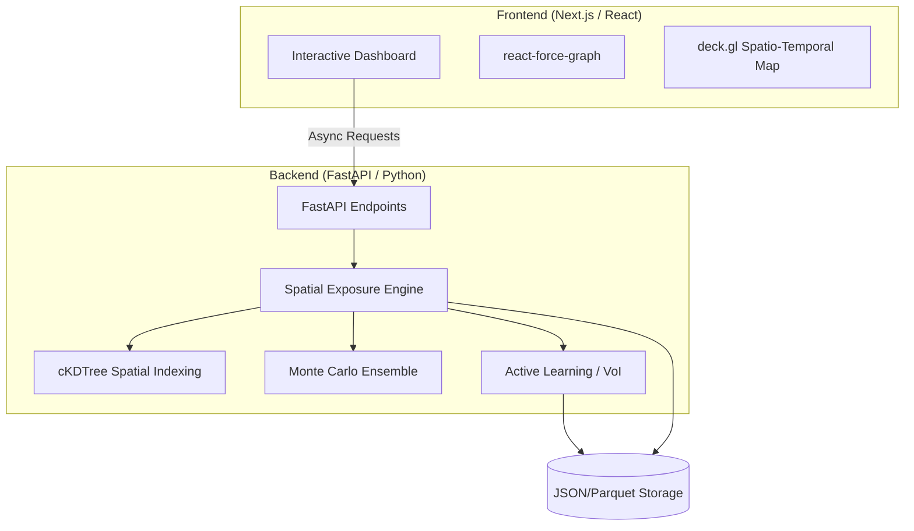

# EpiNexus: Contextual Spatio-Temporal Contact Tracing Engine

EpiNexus is an advanced epidemiological modeling and resource optimization platform designed to bridge the gap between theoretical network science and operational public health. Unlike traditional contact tracing, EpiNexus utilizes a physics-informed **"Ghost Virus"** exposure kernel to calculate precise transmission probabilities based on environmental viral load, spatial indexing, and human mobility.

## 🔬 Project Vision
Built for a 72-hour research hackathon, EpiNexus targets high-impact environments by deploying **Graph-Based Active Learning** to identify high-entropy nodes, maximizing the "Value of Information" to collapse global uncertainty with minimal testing resources.

## 🏗 System Architecture (Decoupled)

## 🚀 Key Features
- **Ghost Virus Model:** Tracks environmental viral decay ($V_{loc}(t)$) based on ACH and half-life.
- **Spatial Optimization:** Uses `cKDTree` to handle thousands of agents without $O(N^2)$ bottlenecks.
- **Uncertainty Halos:** Visualizes 95% Confidence Intervals as dynamic halos in a WebGL-accelerated graph.
- **Active Learning:** Recommends the "next most valuable" person to test to reduce total system entropy.
- **Directed Causality:** Transmission modeled as a Directed Acyclic Graph (DAG) for scientific rigor.

## 📁 Project Structure
- `PRD.md`: Detailed product requirements and user stories.
- `TECH_STACK.md`: Technical specifications and library selections.
- `BACKEND.md`: Mathematical formulas and architectural logic.
- `FRONTEND.md`: UI/UX design and visualization strategy.
- `DATA.md`: Data schemas and synthetic generation plans.
- `RESEARCH.md`: Methodology for the companion research paper.

## 🛠 Quick Start
(Instructions for environment setup will be added during the execution phase)
